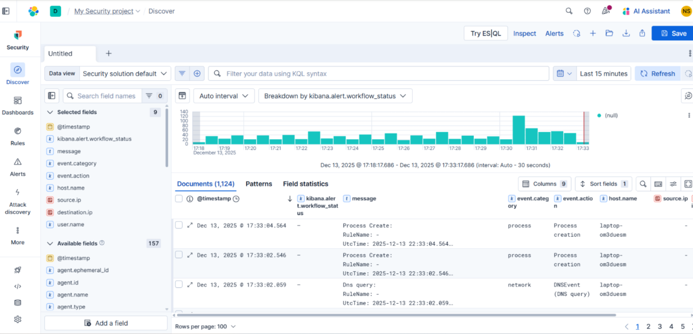

# Elastic SIEM + Fleet + Sysmon — Endpoint Telemetry Pipeline

## Environment / Tools
- Elastic SIEM (Elastic Cloud)
- Elastic Agent (Fleet-managed)
- Windows 10/11 endpoint
- Sysmon v15+
- Kibana (Discover, Security app)
- KQL

## Data Ingested
- Process creation events (Sysmon Event ID 1)
- Network connection events (Sysmon Event ID 3)
- PowerShell execution telemetry
- Windows security and system logs

## Detections / Findings
- Verified successful ingestion of high-fidelity Sysmon telemetry into Elastic SIEM
- Identified process execution chains and parent/child relationships using KQL
- Observed outbound network connections tied to specific processes
- Confirmed visibility of PowerShell activity for investigation and threat hunting
- Validated timestamp accuracy and host attribution for SOC triage
  
## Architecture
Windows Endpoint 
→ Sysmon 
→ Elastic Agent (Fleet) 
→ Elastic SIEM 
→ Kibana (Discover / Security)

## Validation Evidence

## SOC Relevance
This project demonstrates real-world SOC fundamentals including endpoint telemetry ingestion, log validation, investigation-ready visibility, and query-driven analysis aligned with MITRE ATT&CK techniques. The pipeline mirrors how enterprise SOC teams monitor Windows endpoints for suspicious behavior and respond to alerts.

